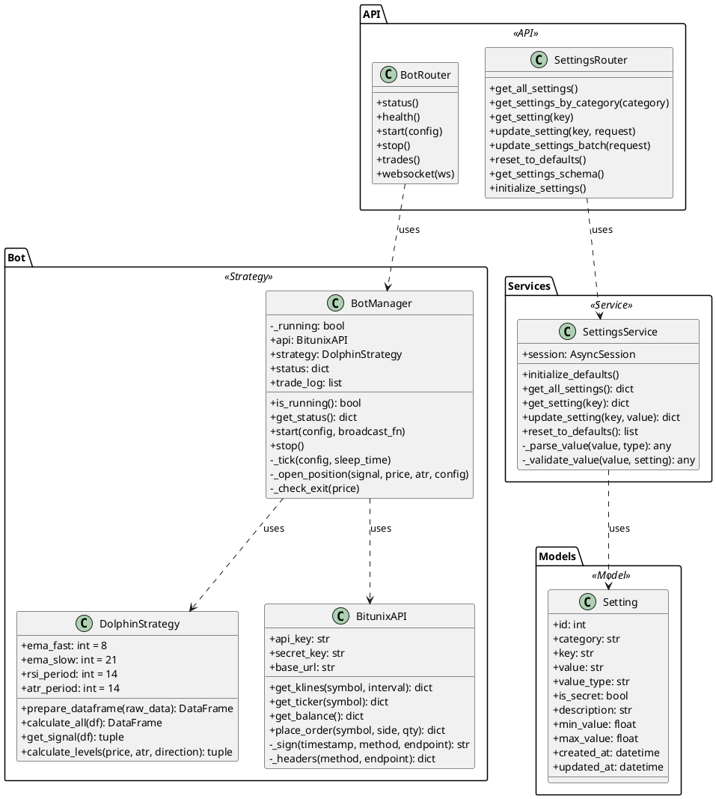
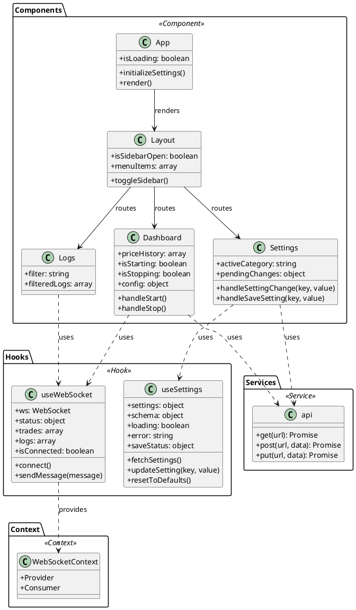
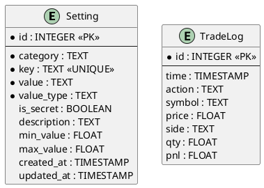
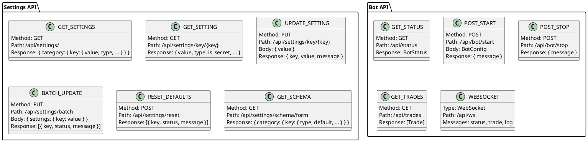

# C4 - Code Diagramme

## Überblick

Diese Ebene zeigt die wichtigsten Klassen und Interfaces des Systems.

## Backend Klassendiagramm



## Frontend Klassendiagramm



## Datenbank Schema



## API Endpoints



## WebSocket Nachrichten

```plantuml
@startuml C4_WebSocket_Messages

package "Client → Server" {
    note right
      Aktuell: Keine Client → Server Nachrichten
      (Nur Verbindungsaufbau)
    end note
}

package "Server → Client" {
    class StatusMessage {
        type: "status"
        running: boolean
        position: string
        entry_price: float
        current_price: float
        stop_loss: float
        take_profit: float
        pnl: float
        total_pnl: float
        symbol: string
        dry_run: boolean
    }
    
    class TradeMessage {
        type: "trade"
        message: string
        time: datetime
        action: string
        price: float
        stop_loss: float
        take_profit: float
        pnl: float
    }
    
    class LogMessage {
        type: "log"
        level: string
        message: string
    }
}

@enduml
```

## Konfigurationsobjekte

### BotConfig (Backend)
```python
{
    api_key: str
    secret_key: str
    symbol: str = "BTCUSDT"
    timeframe: str = "5m"
    risk_pct: float = 0.02
    dry_run: bool = True
}
```

### Settings (Frontend)
```javascript
{
    trading: {
        symbol: { value: "BTCUSDT", type: "string" },
        risk_pct: { value: 0.02, type: "float", min: 0.01, max: 0.10 },
        dry_run: { value: true, type: "bool" }
    },
    api: {
        bitunix_api_key: { value: "***", type: "string", is_secret: true }
    }
}
```

## DTOs (Data Transfer Objects)

### SettingResponse
```python
{
    value: Any
    type: str  # "string" | "int" | "float" | "bool"
    is_secret: bool
    description: str | None
    min: float | None
    max: float | None
}
```

### UpdateSettingRequest
```python
{
    value: Any
}
```

### BotStatus
```python
{
    running: bool
    position: str | None
    entry_price: float
    current_price: float
    stop_loss: float
    take_profit: float
    pnl: float
    total_pnl: float
    last_signal: str | None
    last_update: str  # ISO datetime
    symbol: str
    dry_run: bool
}
```

## Interfaces

### SettingsService Interface
```typescript
interface ISettingsService {
    initialize_defaults(): Promise<void>
    get_all_settings(include_secrets?: boolean): Promise<SettingsMap>
    get_setting(key: string, include_secrets?: boolean): Promise<Setting>
    update_setting(key: string, value: any): Promise<UpdateResult>
    update_settings_batch(updates: Record<string, any>): Promise<UpdateResult[]>
    reset_to_defaults(): Promise<UpdateResult[]>
}
```

### BotManager Interface
```typescript
interface IBotManager {
    is_running(): boolean
    get_status(): BotStatus
    get_trade_log(): Trade[]
    start(config: BotConfig, broadcast_fn: Function): Promise<void>
    stop(): Promise<void>
}
```

## Validierungsregeln

### Settings Validation
```python
# Risk Percentage
min: 0.01  # 1%
max: 0.10  # 10%

# EMA Periods
ema_fast: min=5, max=50
ema_slow: min=10, max=100

# RSI Levels
rsi_overbought: min=60, max=90
rsi_oversold: min=10, max=40

# Timeframes
allowed: ["1m", "5m", "15m", "1h"]
```

## Type Mappings

### Database → Python
```
sqlite TEXT     → Python str
sqlite INTEGER  → Python int
sqlite REAL     → Python float
sqlite BOOLEAN  → Python bool
sqlite TIMESTAMP → Python datetime
```

### Python → JSON
```
Python str      → JSON string
Python int      → JSON number
Python float    → JSON number
Python bool     → JSON boolean
Python datetime → JSON string (ISO format)
Python None     → JSON null
```

## Wichtige Dateien

### Backend
```
backend/
├── models/
│   └── setting.py          # Setting Model
├── services/
│   └── settings_service.py # Business Logic
├── api/
│   ├── settings.py         # API Routes
│   └── routes.py           # Bot Routes
├── bot/
│   ├── bot_manager.py      # Bot Lifecycle
│   ├── strategy.py         # Trading Logic
│   └── bitunix_api.py      # Exchange Client
└── core/
    ├── config.py           # Configuration
    └── database.py         # DB Connection
```

### Frontend
```
frontend/src/
├── hooks/
│   ├── useWebSocket.jsx    # WS Hook
│   └── useSettings.jsx     # Settings Hook
├── pages/
│   ├── Dashboard.jsx       # Main Dashboard
│   ├── Settings.jsx        # Settings Page
│   └── Logs.jsx            # Logs Page
├── components/
│   └── layout/
│       └── Layout.jsx      # App Layout
├── services/
│   └── api.js              # API Client
└── styles/
    └── glassmorphism.css   # Design System
```
